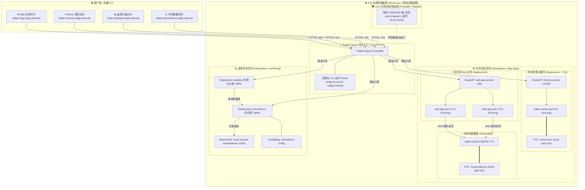

<div align="center">

# ☸️ 轻量级边缘云原生集群 (K3s) 自动化交付与微服务基础设施治理
### 基于 AlmaLinux 9 + K3s 原生集群 + CSI 动态存储 + Traefik Ingress 网关 + 全栈可观测性

[-2B579A?style=for-the-badge&logo=almalinux&logoColor=white)](https://almalinux.org/)
[](https://k3s.io/)
[-24A1C1?style=for-the-badge&logo=traefik&logoColor=white)](https://traefik.io/)
[](https://github.com/rancher/local-path-provisioner)
[](https://grafana.com/)
[](./LICENSE)

<p align="center">
  <b>构建企业边缘机房轻量云原生基础设施：有状态服务持久化编排、泛域名 TLS 网关安全、全栈指标可观测与生产自愈排障闭环</b>
</p>

[📐 架构全景](#-一-架构拓扑全景图) •
[💾 存储与编排](#-二-有状态服务与动态存储治理-statefulset--csi) •
[🛡️ 生产排障](#-三-云原生生产排障与自愈演练矩阵) •
[🌐 网关与安全](#-四-云原生微服务与-traefik-tls-网关治理) •
[📊 可观测体系](#-五-边缘全栈可观测性监控体系) •
[📂 目录结构](#-六-仓库目录结构全貌) •
[🚀 快速启动](#-七-快速部署与演练指南)

</div>

---

> [!NOTE]
> 本项目基于 **AlmaLinux 9 (RHEL 9 系)** 原生托管轻量级 K3s 集群，全面落地 Kubernetes 声明式资源编排、CSI 动态存储卷供给、自建私有 CA 泛域名 TLS 网关卸载与全栈 Prometheus + Grafana 可观测性监控。

---

## 📐 一、 架构拓扑全景图


---

## 💾 二、 有状态服务与动态存储治理 (StatefulSet & CSI)

- [x] **CSI 动态存储自动供给：**基于 `local-path` 存储类与 `PersistentVolumeClaim (PVC)` 声明，落地 `WaitForFirstConsumer` 延迟绑定机制，容器调度时自动在底层分配独立物理卷并挂载。
- [x] **单机容器资产云原生重构：**将传统单机 Docker 架构的 Memos 笔记应用重构为声明式 Kubernetes 清单，依托动态 PVC 与标准 UID/GID 权限隔离，实现应用重启与跨节点漂移时数据零丢失。
- [x] **StatefulSet 确定性编排：**为 MySQL 5.7 提供固定网络标识（edge-mysql-0）与专用持久化卷，彻底解决裸容器重启数据丢失与网络寻址漂移痛点。
- [x] **双探针协同防误杀设计：**引入 startupProbe（TCP 探针赋予 120 秒建库缓冲期），彻底解决生产环境中 livenessProbe 过早介入引发的无限 Killing 重启死循环。
- [x] **微服务 2 副本负载均衡：**业务前端无状态服务采用 Deployment 声明 2 副本，配合 ClusterIP Service 实现容器内部 DNS 服务发现与跨 Pod 负载均衡。

---

## 🛡️ 三、 云原生生产排障与自愈演练矩阵

在生产运维与边缘集群落地过程中，系统沉淀了以下深度排障案例与治理指标：

| 演练场景                 | 故障现象与错误码                                | 底层根因剖析                       | 治理与自愈成效                                               |
| :----------------------- | :---------------------------------------------- | :--------------------------------- | :----------------------------------------------------------- |
| **Linux Netfilter CNI 转发拦截**     | Ingress 访问报 502 Bad Gateway / i/o timeout | AlmaLinux 9 默认 firewalld/nftables 封锁内核 FORWARD 链，跨 Namespace 容器报文被拦截   | 将 K3s Pod/Service 网段及 cni0/flannel.1 接口划入 trusted 区域，恢复全网路由 |
| **探针激进导致滚动更新死锁**   | Deployment 长期处于 0/1 Running 并阻塞销毁旧副本          | Grafana 启动初需跑 SQLite 数据迁移，激进的 readinessProbe 过早介入探测失败 | 优化探针延迟与策略，消除探针死锁，Service 正常绑定 Endpoints 恢复解析 |
| **Pod 物理删除自愈**     | 模拟 kubectl delete pod edge-mysql-0 异常崩溃  | StatefulSet 控制器感知状态漂移  | 1 秒内原地拉起新 Pod，自动重挂原 PVC 卷，数据 100% 零丢失  |
| **内存熔断排错 (OOM)** | STATUS: OOMKilled ➕ Exit Code: 137  | 容器内存超出 limits.memory: 30Mi | 触发 Linux cgroup 强制处决并进入 CrashLoopBackOff 退避保护    |
| **镜像拉取超时治理** | Pod 状态显示 ImagePullBackOff | 官方 Docker Hub 在边缘网络受限 | 切换国内公共镜像加速源，消除拉取重试死锁|
| **Ingress 现代标准演进** | Warning: ingress.class is deprecated | K8s v1.18+ 废弃旧版注解语法 | 升级为 spec.ingressClassName: traefik，消除版本弃用告警 |

---

## 🌐 四、 云原生微服务与 Ingress 网关治理

> [!TIP]
> 针对边缘机房外部流量统一接入与安全合规要求，本项目基于 Traefik Ingress 实现了全链路 HTTPS 证书卸载与泛域名动态分发。

1. **企业私有 CA 泛域名体系：** 基于 OpenSSL 自建根 CA，签发包含 SAN 扩展的泛域名证书（*.edge.internal），通过 Kubernetes TLS Secret 统一挂载。
2. **443 端口 TLS Termination (证书卸载)：** 外部请求统一走 HTTPS 443 端口接入，由 Traefik 完成解密与证书校验，集群内向 Pod 转发明文 HTTP，阻断外部监听并降低业务容器开销。
3. **多租户与精准路由分流：** 基于 Host 规则在单一网关下精准分流 4 套核心业务系统：
   - app.edge.internal ➔ Web 业务集群
   - memos.edge.internal ➔ 边缘笔记应用
   - grafana.edge.internal ➔ 监控可视化大盘
   - prometheus.edge.internal ➔ 时序数据库原生控制台

---

## 📊 五、 边缘全栈可观测性监控体系

本项目将 Prometheus + Grafana + Node-Exporter 监控套件完整云原生化纳管于 monitoring 命名空间：

- **底层主机指标采集 (DaemonSet)：** node-exporter 挂载宿主机 /proc 与 /sys，以 hostNetwork 模式无侵入采集边缘节点物理 CPU、内存、磁盘 I/O 及网络带宽吞吐。
- **声明式时序配置 (ConfigMap)：** 将抓取配置解耦为 prometheus-config，实现 5 秒级高精度指标拉取。
- **专业级可视化看板：** Grafana 内置集成经典 Linux 节点运维大盘（Dashboard ID: 1860），全中文实时呈现系统负载峰值、TCP 连接数波动与磁盘读写瓶颈。

---

## 📂 六、 仓库目录结构全貌

```text
k3s-edge-cloudnative-lab/
├── README.md                           # 🏛️ 云原生集群全景白皮书
├── LICENSE                             # 📜 Apache License 2.0 许可证
├── push.sh                             # 🚀 一键自动化资产同步与流水线
├── .gitignore                          # 🛡️ 安全过滤规则 (放行 example 与核心配置)
│
├── tls/                                # 🔒 私有 CA 证书资产
│   ├── edge-tls.crt                    # 自建 CA 签发的泛域名 TLS 证书
│   └── edge-tls.key                    # TLS 私钥
│
├── manifests/                          # ☸️ 声明式 Kubernetes 编排清单
│   ├── 00-storage/
│   │   └── mysql-pvc.yaml              # CSI 动态存储卷申请声明 (PVC 2Gi)
│   ├── 01-database/
│   │   └── mysql-statefulset.yaml      # MySQL 5.7 StatefulSet + 双探针 + 资源限额
│   ├── 02-apps/
│   │   ├── web-app-deployment.yaml     # 2 副本高可用 Web 业务编排清单
│   │   └── memos.yaml                  # Memos 笔记应用 (Deployment + PVC 2Gi + Service)
│   ├── 03-ingress/
│   │   └── app-ingress.yaml            # Traefik Ingress 泛域名外部路由与 TLS 卸载规则
│   ├── 04-chaos-oom.yaml               # 生产级 OOMKilled / CrashLoopBackOff 故障注入清单
│   └── 05-monitoring/
│       └── monitoring-stack.yaml       # Prometheus + Grafana + Node-Exporter 全栈监控清单
│
├── scripts/                            # 🛠️ 集群验证与排障脚本
│   ├── 01_verify_cluster.sh            # 集群组件与业务资源全局巡检脚本
│   └── 02_pod_self_healing_test.sh     # Pod 崩溃删除与自动原地自愈测试工具
│
└── docs/                               # 📖 云原生生产排障与架构深度手册
    ├── 01-edge-k8s-architecture.md     # 边缘轻量集群架构与 CSI 动态存储设计
    └── 02-k8s-pod-troubleshooting-runbook.md # OOMKilled、探针死锁与 Netfilter 转发排障实战手册
```

---

## 🚀 七、 快速部署与演练指南

# 1. 一键部署全套云原生业务栈

```bash
# 1. 创建命名空间并导入 TLS 证书 Secret
kubectl create namespace edge-apps
kubectl create namespace monitoring

kubectl create secret tls edge-tls-secret --cert=tls/edge-tls.crt --key=tls/edge-tls.key -n edge-apps
kubectl create secret tls edge-tls-secret --cert=tls/edge-tls.crt --key=tls/edge-tls.key -n monitoring

# 2. 部署基础存储、数据库与业务微服务
kubectl apply -f manifests/00-storage/
kubectl apply -f manifests/01-database/
kubectl apply -f manifests/02-apps/
kubectl apply -f manifests/03-ingress/

# 3. 一键拉起全栈监控套件
kubectl apply -f manifests/05-monitoring/

# 4. 查看全套资源就绪状态
kubectl get pods,pvc,ingress -A

```

### 2.宿主机 Hosts 解析配置与访问
在本地 Windows 宿主机 C:\Windows\System32\drivers\etc\hosts 追加解析：

```bash

<WSL2_IP> app.edge.internal memos.edge.internal grafana.edge.internal prometheus.edge.internal

```
- **Web 应用**：https://app.edge.internal
- **Memos 笔记**：https://memos.edge.internal
- **Grafana 大盘**：https://grafana.edge.internal（默认账号: admin / 密码: admin）
- **Prometheus 控制台**：https://prometheus.edge.internal

### 3. 执行有状态服务 Pod 容灾自愈测试

```bash

./scripts/02_pod_self_healing_test.sh

```

### 4. 执行 OOMKilled 故障注入与排障

```bash

# 部署内存超限故障 Pod
kubectl apply -f manifests/04-chaos-oom.yaml

# 查看 OOMKilled (Exit Code 137) 状态
kubectl get pod chaos-oom-demo -n edge-apps

# 演练完毕清理
kubectl delete -f manifests/04-chaos-oom.yaml

```

---

> [!IMPORTANT]
> 本项目所有编排清单均在 **AlmaLinux 9 (Kernel 5.14/6.x) + K3s 原生集群** 实测校验通过，具备健壮性，支持开箱即用平滑迁移至标准 Kubernetes (K8s) 环境。
