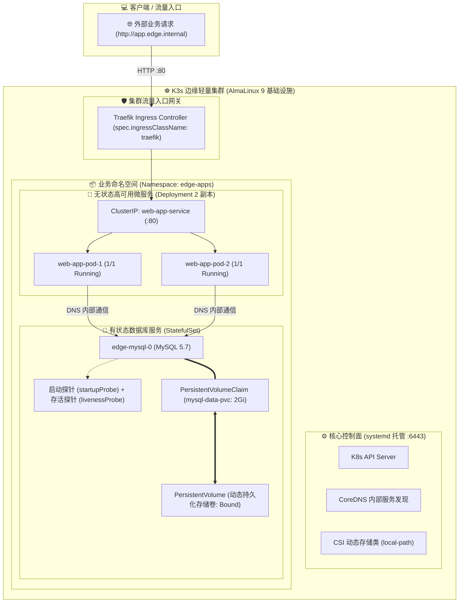

<div align="center">

# ☸️ 轻量级边缘云原生集群 (K3s) 自动化交付与微服务基础设施治理
### 基于 AlmaLinux 9 + K3s 原生集群 + CSI 动态存储 + Traefik Ingress 网关

[-2B579A?style=for-the-badge&logo=almalinux&logoColor=white)](https://almalinux.org/)
[](https://k3s.io/)
[](https://traefik.io/)
[](https://github.com/rancher/local-path-provisioner)
[](./LICENSE)

<p align="center">
  <b>构建企业边缘机房轻量云原生基础设施：有状态服务持久化编排、微服务高可用、流量网关与生产自愈排障全栈方案</b>
</p>

[📐 架构全景](#-一-架构拓扑全景图) •
[💾 存储与编排](#-二-有状态服务与动态存储治理-statefulset--csi) •
[🛡️ 生产排障](#-三-云原生生产排障与自愈演练矩阵) •
[🌐 网关治理](#-四-云原生微服务与-ingress-网关治理) •
[📂 目录结构](#-五-仓库目录结构全貌) •
[🚀 快速启动](#-六-快速部署与演练指南)

</div>

---

> [!NOTE]
> 本项目基于 **AlmaLinux 9** 原生托管 K3s 云原生集群，落地了 Kubernetes 声明式资源管理、CSI 动态存储供给与生产级故障自愈。

---

## 📐 一、 架构拓扑全景图



--- 

## 💾 二、 有状态服务与动态存储治理 (StatefulSet & CSI)

- [x] **CSI 动态存储自动供给：** 基于 `local-path` 存储类与 `PersistentVolumeClaim (PVC)` 声明，落地 `WaitForFirstConsumer` 延迟绑定机制，容器调度时自动在底层分配独立物理卷并挂载。
- [x] **StatefulSet 确定性编排：** 为 MySQL 5.7 提供固定网络标识（`edge-mysql-0`）与专用持久化卷，彻底解决裸容器重启数据丢失与网络寻址漂移痛点。
- [x] **双探针协同防误杀设计：** 引入 `startupProbe`（TCP 探针赋予 120 秒建库缓冲期），彻底解决生产环境中 `livenessProbe` 过早介入引发的无限 `Killing` 重启死循环。
- [x] **微服务 2 副本负载均衡：** 业务前端/无状态服务采用 `Deployment` 声明 2 副本，配合 `ClusterIP Service` 实现容器内部 DNS 服务发现与跨 Pod 负载均衡。

---

## 🛡️ 三、 云原生生产排障与自愈演练矩阵

在生产运维中，系统默认随时可能发生硬件或容器异常。本项目沉淀了以下核心排障案例与复盘指标：

| 演练场景                 | 故障现象与错误码                                | 底层根因剖析                       | 治理与自愈成效                                               |
| :----------------------- | :---------------------------------------------- | :--------------------------------- | :----------------------------------------------------------- |
| **Pod 物理删除自愈**     | 模拟 `kubectl delete pod edge-mysql-0` 异常崩溃 | StatefulSet 控制器感知状态漂移     | **1 秒内原地拉起新 Pod**，自动重挂原 PVC 卷，数据 100% 零丢失 |
| **内存熔断排错 (OOM)**   | `STATUS: OOMKilled` ➕ `Exit Code: 137`          | 容器内存超出 `limits.memory: 30Mi` | 触发 Linux cgroup 强制处决并进入 `CrashLoopBackOff` 退避保护 |
| **镜像拉取超时治理**     | Pod 状态显示 `ImagePullBackOff`                 | 官方 Docker Hub 在国内网络受限     | 切换国内公共镜像加速源，消除拉取重试死锁                     |
| **Ingress 现代标准演进** | `Warning: ingress.class is deprecated`          | K8s v1.18+ 废弃旧版注解语法        | 升级为 `spec.ingressClassName: traefik`，消除版本弃用告警    |


---

## 🌐 四、 云原生微服务与 Ingress 网关治理

> [!TIP]
> 针对边缘机房外部流量统一接入场景，本项目基于 K8s 原生声明式 Ingress 实现了全自动的服务发现与路由分流。

1. **统一入口路由：** 通过 Traefik Ingress 控制器，将外部域名 `http://app.edge.internal` 的 HTTP 请求精准路由至内部 `web-app-service:80` 负载均衡器。
2. **零停机滚动更新：** Deployment 配置了健康检查探针（Readiness & Liveness），业务版本迭代时实现 Pod 逐个滚动替换，对外服务零中断。
3. **资源隔离配额：** 所有 Pod 均显式配置 `resources.requests`（预留）与 `resources.limits`（硬限额），杜绝故障微服务耗尽宿主机资源。

---

##📂 五、 仓库目录结构全貌

```text
k3s-edge-cloudnative-lab/
├── README.md                           # 🏛️ 云原生集群全景白皮书
├── LICENSE                             # 📜 Apache License 2.0 许可证
├── push.sh                             # 🚀 一键自动化发布流水线
├── .gitignore                          # 🛡️ 敏感密钥与系统日志安全过滤配置
│
├── manifests/                          # ☸️ 声明式 Kubernetes 编排清单
│   ├── 00-storage/
│   │   └── mysql-pvc.yaml              # CSI 动态存储卷申请声明 (PVC 2Gi)
│   ├── 01-database/
│   │   └── mysql-statefulset.yaml      # MySQL 5.7 StatefulSet + 双探针 + 资源限额
│   ├── 02-apps/
│   │   └── web-app-deployment.yaml     # 2 副本高可用 Web 业务编排清单
│   ├── 03-ingress/
│   │   └── app-ingress.yaml            # Traefik Ingress 外部路由规则声明
│   └── 04-chaos-oom.yaml               # 生产级 OOMKilled / CrashLoopBackOff 故障注入清单
│
├── scripts/                            # 🛠️ 集群验证与混沌演练脚本
│   ├── 01_verify_cluster.sh            # 集群组件与业务资源全局巡检脚本
│   └── 02_pod_self_healing_test.sh     # Pod 崩溃删除与自动原地自愈测试工具
│
└── docs/                               # 📖 云原生生产排障与架构深度手册
    ├── 01-edge-k8s-architecture.md     # 边缘轻量集群架构与 CSI 动态存储设计
    └── 02-k8s-pod-troubleshooting-runbook.md # OOMKilled、探针死锁与自愈实战手册

```

---

## 🚀 六、 快速部署与演练指南

1. 一键部署全套云原生业务栈
# 1. 创建业务专属命名空间并申请动态存储

```bash

kubectl create namespace edge-apps
kubectl apply -f manifests/00-storage/

# 2. 部署数据库与微服务业务
kubectl apply -f manifests/01-database/
kubectl apply -f manifests/02-apps/
kubectl apply -f manifests/03-ingress/

# 3. 查看全套资源就绪状态
kubectl get pods,pvc,ingress -n edge-apps

```

### 2. 执行有状态服务 Pod 容灾自愈测试

```bash

./scripts/02_pod_self_healing_test.sh

```

### 3. 执行 OOMKilled 故障注入与排障

```bash

# 部署内存超限故障 Pod
kubectl apply -f manifests/04-chaos-oom.yaml

# 查看 OOMKilled (Exit Code 137) 状态
kubectl get pod chaos-oom-demo -n edge-apps

# 演练完毕清理
kubectl delete -f manifests/04-chaos-oom.yaml

```
---

> [!IMPORTANT]
> 本项目所有编排清单均在 **AlmaLinux 9 + K3s v1.29.3** 原生集群实测校验通过，支持开箱即用无缝迁移至标准 Kubernetes 生产环境。
